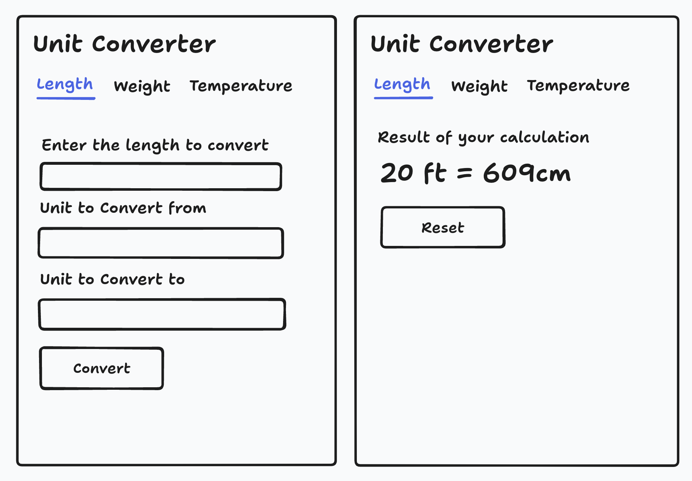

# Unit Converter

A simple web application to convert between different units of measurement, built with Golang.

## Features

- **Length Conversion**: Convert between millimeters, centimeters, meters, kilometers, inches, feet, yards, and miles.
- **Weight Conversion**: Convert between milligrams, grams, kilograms, ounces, and pounds.
- **Temperature Conversion**: Convert between Celsius, Fahrenheit, and Kelvin.
- Clean and responsive user interface for a smooth experience.
- Built with the standard Go net/http package and HTML templates for easy web development.

## Table of Contents

- [Features](#features)
- [Setup Instructions](#setup-instructions)
- [Usage](#usage)
- [Screenshots](#screenshots)
- [License](#license)

## Setup Instructions

### Prerequisites

- Go 1.18 or higher
- A working internet connection to download dependencies

### Steps to Run Locally

1. **Clone the repository**:

   ```bash
   git clone https://github.com/your-username/unit-converter.git
   cd unit-converter
   ```

2. **Install Dependencies** (if any):

   There are no third-party dependencies for this project since it uses Go's standard `net/http` and `html/template` packages.

3. **Run the Application**:

   Use the following command to start the server:

   ```bash
   go run main.go
   ```

   By default, the application will run on `localhost:8080`.

4. **Access the Web App**:

   Open your web browser and navigate to:

   ```plaintext
   http://localhost:8080
   ```

## Usage

### Length Conversion

1. Select the "Length" tab.
2. Enter the value you want to convert.
3. Choose the units to convert from and to (e.g., `ft` to `cm`).
4. Click "Convert" to see the result.

### Weight Conversion

1. Select the "Weight" tab.
2. Enter the weight value to convert.
3. Choose the units to convert from and to (e.g., `kg` to `lb`).
4. Click "Convert" to view the result.

### Temperature Conversion

1. Select the "Temperature" tab.
2. Enter the temperature value to convert.
3. Choose the units to convert from and to (e.g., `Celsius` to `Fahrenheit`).
4. Click "Convert" to get the converted temperature.

## Screenshots

### Length Conversion Interface and Conversion Result


## License

This project is licensed under the MIT License. See the [LICENSE](LICENSE) file for details.
